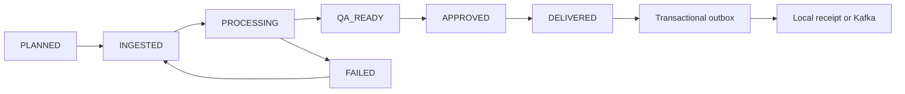

# Architecture and design decisions

## Survey lifecycle

The application is one deployable Spring Boot application with domain packages. It is not five independent microservices. The delivery transport has a separable boundary; a future service split should preserve event IDs, retries, idempotency, and contract versions.

## Transactions and consistency

ProjectService owns transactions. A row lock serializes mutations on one project; the version supplied by the client rejects stale requests. Point replacement and audit recording occur in the same transaction. A failed validation call rolls back the intermediate PROCESSING transition. Failed quality results intentionally commit the FAILED state for investigation.

A synchronous application event inserts the outbox row within the delivery transaction. Publishing waits for transport acknowledgement. The database and broker do not share an atomic transaction, so a process crash can redeliver an event. Consumers must deduplicate by event ID. Local transport writes a receipt in the same database transaction. Kafka connectivity is an optional integration and requires a broker.

The current point-summary cache is process-local. Use one application replica, or disable/replace this cache with distributed invalidation before scaling writes across replicas. An optimistic lock on a JPA entity does not make all database operations automatically safe; mutations deliberately acquire the project lock.

## GIS contract

Inputs are northern WGS84 UTM EPSG:32601..32660 in metres. All points in a project use the same CRS. Area uses JTS polygon geometry; self-intersections are rejected. Spatial querying uses an STRtree. Elevation interpolation uses inverse distance weighting. Neither interpolation nor RMSE is a full photogrammetry pipeline.

A quality report compares independent checkpoint heights in the same vertical datum. Coordinate transformation, vertical datum conversion, LAS/LAZ ingestion, raster tiling, and orthomosaic reconstruction are not implemented. Input names and sample elevations are synthetic.

CSV exports remain projected-coordinate CSV. RFC 7946 GeoJSON requires WGS84 longitude/latitude; assigning a GeoJSON label to UTM metres would be incorrect. See [RFC 7946](https://www.rfc-editor.org/rfc/rfc7946).

## Security

Session and HTTP Basic authentication retain CSRF protection. The dashboard obtains a token from /api/v1/csrf. Method authorization protects state-changing operations; read endpoints require authentication. Passwords use BCrypt. Local startup can generate credentials; shared deployment should supply secrets through environment or secret management.

The jwt profile uses issuer validation and an aerotopo audience, with the roles claim mapped to role authorities. It is stateless and expects an external identity provider. TLS terminates at a trusted ingress in deployed environments. JWT issuer integration has not been verified against a live provider.

## Scaling decisions

Start with one application instance and PostgreSQL. Benchmark observed bottlenecks before splitting services. Large imagery belongs in object storage with metadata and checksums in the relational database; the current point importer is capped and is not a multi-gigabyte upload service.

The executor has bounded concurrency and queue capacity. Oversized datasets require chunked processing with persistent job state and checkpoints, not an unbounded in-memory list. For independent service extraction, use owned schemas, contract tests, outbox delivery, and a staged migration. No unsupported distributed atomicity claims.

## AI and integration boundaries

There is no Spring AI, LLM, Redis, RabbitMQ, Eureka, Feign, SOAP, or WebFlux implementation in the current application. Their workbook questions stay visible as coverage gaps or related architectural context. Add real integrations with explicit prerequisites and tests; do not rename local implementations to claim coverage.
